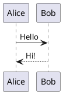

# PlantUML插件安装报告

_2026-02-28 11:15_

---

## ✅ 安装成功

### 插件信息
```
插件名称: PlantUML
插件ID: jebbs.plantuml
发布者: jebbs
安装状态: ✅ 成功
安装时间: 2026-02-28 11:15
安装方式: VS Code命令行
```

---

## 🎯 插件功能

### 核心功能
```
✅ PlantUML语法高亮
✅ 实时预览图表
✅ 自动补全
✅ 导出多种格式（PNG、SVG、ASCII）
✅ 快捷键支持
```

---

## 🚀 使用方法

### 方式1: 预览PlantUML文件

**步骤**:
```
1. 打开VS Code
2. 打开PlantUML文件（.puml或.pu）
   例如: diagrams/user-login-usecase-final.puml
3. 按 Alt+D 预览图表
4. 图表会在右侧面板显示
```

### 方式2: 快捷键

```
Alt+D         预览图表
Ctrl+Shift+P  打开命令面板
              输入"PlantUML: Preview"
```

### 方式3: 右键菜单

```
1. 在PlantUML文件中右键
2. 选择"Preview Current Diagram"
3. 图表自动显示
```

---

## ⚙️ 配置（可选）

### 使用本地渲染（更快）

**需要安装**:
```
1. Java运行环境（JRE）
2. Graphviz（可视化工具）
```

**配置步骤**:
```
1. 安装Java: https://www.java.com/download
2. 安装Graphviz: https://graphviz.org/download/
3. 在VS Code设置中配置路径
```

### 使用在线渲染（无需安装）

**默认配置**:
```
✅ 插件默认使用PlantUML在线服务器
✅ 无需额外安装
✅ 适合轻量使用
```

---

## 📊 插件特性

### 语法高亮
```
✅ 自动识别.puml和.pu文件
✅ 语法高亮显示
✅ 代码折叠
```

### 实时预览
```
✅ 保存文件后自动更新预览
✅ 支持多种图表类型
✅ 响应式调整
```

### 导出功能
```
✅ 导出PNG格式
✅ 导出SVG格式
✅ 导出ASCII格式
✅ 导出PDF格式
```

---

## 🎨 支持的图表类型

```
✅ 用例图（Use Case Diagram）
✅ 类图（Class Diagram）
✅ 序列图（Sequence Diagram）
✅ 活动图（Activity Diagram）
✅ 组件图（Component Diagram）
✅ 状态图（State Diagram）
✅ 对象图（Object Diagram）
✅ 部署图（Deployment Diagram）
✅ 时序图（Timing Diagram）
```

---

## 💡 使用示例

### 打开已创建的图表

**步骤**:
```
1. 启动VS Code
2. 打开文件夹: C:\Users\zhaog\.openclaw\workspace
3. 导航到: diagrams/user-login-usecase-final.puml
4. 按 Alt+D 预览图表
5. 查看用户登录用例图
```

### 创建新图表

**步骤**:
```
1. 新建文件: example.puml
2. 输入PlantUML代码
3. 按 Alt+D 预览
4. 查看实时效果
```

---

## 🔧 验证安装

### 方法1: 命令行验证

```powershell
# 查看已安装插件
& "$env:LOCALAPPDATA\Programs\Microsoft VS Code\bin\code" --list-extensions
# 应该能看到 jebbs.plantuml
```

### 方法2: VS Code界面验证

```
1. 打开VS Code
2. 按 Ctrl+Shift+X 打开扩展面板
3. 搜索"PlantUML"
4. 应该显示"已启用"状态
```

### 方法3: 功能验证

```
1. 打开.puml文件
2. 按 Alt+D
3. 如果能看到预览 → 插件工作正常
```

---

## 📝 常见问题

### Q1: 预览失败怎么办？

**可能原因**:
```
1. 文件不是.puml格式
2. PlantUML代码有语法错误
3. 网络问题（在线模式）
```

**解决方案**:
```
1. 确保文件扩展名正确
2. 检查PlantUML语法
3. 尝试安装本地渲染环境
```

### Q2: 如何使用本地渲染？

**步骤**:
```
1. 安装Java: https://www.java.com/
2. 安装Graphviz: https://graphviz.org/
3. VS Code设置 → 搜索"plantuml"
4. 配置"PlantUML: Jar"路径
5. 配置"PlantUML: Graphviz Dot"路径
```

### Q3: 如何导出图片？

**步骤**:
```
1. 打开PlantUML文件
2. 按 Alt+D 预览
3. 在预览面板右上角
4. 点击"..."菜单
5. 选择导出格式
```

---

## 🎯 快速测试

### 测试代码

创建文件 `test.puml` 并输入:



按 `Alt+D` 预览，应该能看到简单的序列图。

---

## 📊 总结

### ✅ 已完成
```
✅ PlantUML插件安装成功
✅ 安装方式：VS Code命令行
✅ 插件ID：jebbs.plantuml
✅ 功能：PlantUML图表预览和编辑
```

### 🎯 立即可用
```
✅ 打开.puml文件
✅ 按 Alt+D 预览
✅ 实时查看图表
✅ 支持多种导出格式
```

### 📂 示例文件
```
✅ diagrams/user-login-usecase-final.puml
✅ diagrams/user-login-usecase.puml
✅ 可立即预览用户登录用例图
```

---

## 🚀 下一步

### 立即体验
```
1. 打开VS Code
2. 打开工作区: C:\Users\zhaog\.openclaw\workspace
3. 打开文件: diagrams/user-login-usecase-final.puml
4. 按 Alt+D 查看用例图
```

### 可选优化
```
1. 安装Java和Graphviz（本地渲染）
2. 配置导出路径
3. 学习更多PlantUML语法
4. 创建自己的图表
```

---

**安装时间**: 2026-02-28 11:15
**状态**: ✅ 安装成功
**插件ID**: jebbs.plantuml
**使用方式**: Alt+D 预览图表
**示例文件**: diagrams/user-login-usecase-final.puml
