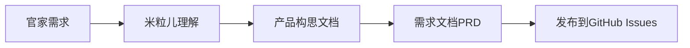
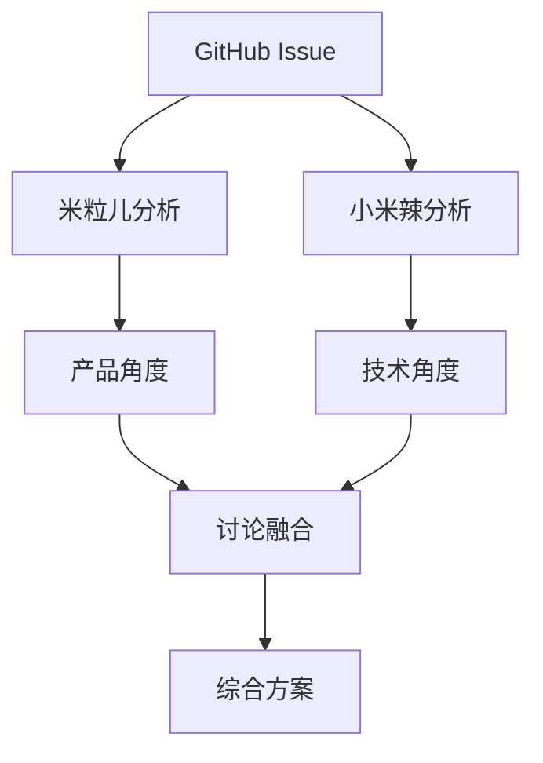
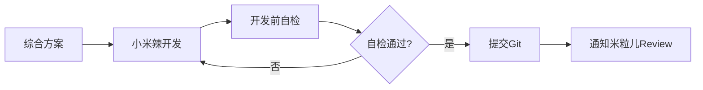
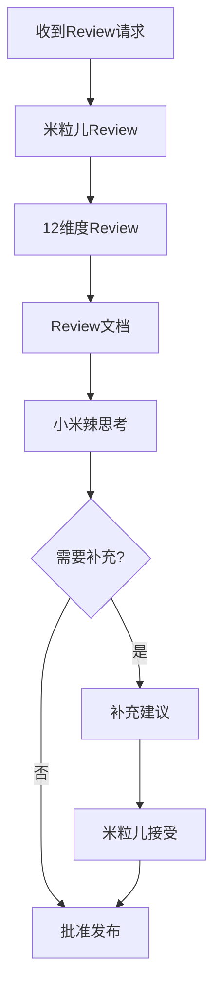
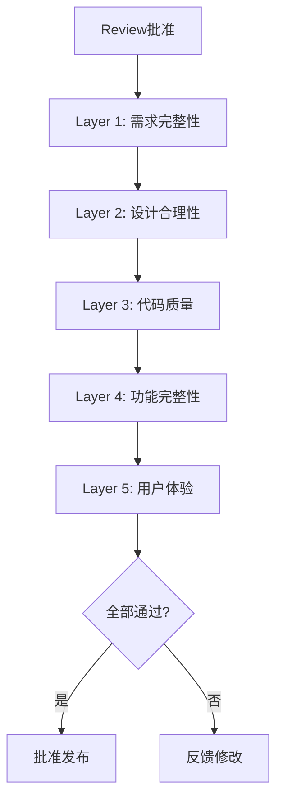

# 双米粒协作系统 v3.1 - 社区启发增强版

**版本**：v3.1  
**发布日期**：2026-03-12  
**核心理念**：协作框架 + Review系统 + 双向思考 + **社区启发** = 持续进化的协作系统

---

## 📋 系统概览

### 三大系统整合

| 系统 | 原定位 | 整合后角色 |
|------|--------|-----------|
| 双米粒协作系统 | 框架（角色+流程+工具） | **主框架** - 定义协作模式 |
| Review系统 | 质量保证（12维度） | **核心环节** - 质量关卡 |
| 双向思考策略 | 思维模式（自检+反向思考） | **思维方式** - 贯穿全程 |

### 整合优势

- ✅ **减少冗余**：一个流程，一个文档，一个脚本
- ✅ **提升效率**：无缝衔接，自动流转
- ✅ **保证质量**：5层验收 + 12维度Review + 双向思考
- ✅ **易于维护**：统一的规范和工具

---

## 🎭 角色定义

### 米粒儿（产品经理 + 质量官）

**核心职责**：
1. **产品构思**：理解需求，定义功能
2. **需求文档**：编写PRD，明确验收标准
3. **并行分析**：与小米辣同时分析方案
4. **5层验收**：需求、设计、代码、功能、体验
5. **12维度Review**：全面质量检查
6. **反向思考**：接受小米辣的补充建议

**工具**：
- 产品模板：`.clawhub/product_template.md`
- Review模板：`.clawhub/review_template.md`
- 协作脚本：`scripts/mili_product_v3.sh`

### 小米辣（开发者 + 测试者）

**核心职责**：
1. **并行分析**：与米粒儿同时分析技术方案
2. **开发实现**：编码、调试、测试
3. **开发前自检**：代码质量、功能完整性、文档完整性
4. **Review后思考**：评估Review完整性，补充遗漏
5. **Git管理**：分支、提交、合并
6. **ClawHub发布**：版本管理、发布流程

**工具**：
- 开发模板：`.clawhub/dev_template.md`
- 自检清单：`.clawhub/self_check_template.md`
- 协作脚本：`scripts/xiaomi_dev_v3.sh`

---

## 🔄 统一协作流程

### Phase 1: 需求与设计（米粒儿主导）



**输出**：
- 产品构思文档（`docs/products/YYYY-MM-DD_功能名_concept.md`）
- 需求文档（`docs/products/YYYY-MM-DD_功能名_prd.md`）
- GitHub Issue（需求讨论）

### Phase 2: 双向并行分析（同时进行）



**米粒儿分析维度**：
- 用户体验
- 产品价值
- 边界情况
- 风险评估

**小米辣分析维度**：
- 技术可行性
- 实现难度
- 性能影响
- 兼容性

**输出**：
- 双方分析文档（合并到PRD）
- 综合方案（更新PRD）

### Phase 3: 开发与自检（小米辣主导）



**开发前自检清单**（4个维度）：

1. **代码质量自检**：
   - ✅ 代码结构清晰
   - ✅ 命名规范
   - ✅ 注释完整
   - ✅ 无明显bug

2. **功能实现自检**：
   - ✅ 功能完整
   - ✅ 测试通过
   - ✅ 边界情况处理
   - ✅ 错误处理

3. **文档完整性自检**：
   - ✅ SKILL.md完整
   - ✅ package.json准确
   - ✅ 使用说明清晰
   - ✅ 示例代码提供

4. **潜在风险评估**：
   - ✅ 无安全风险
   - ✅ 无性能问题
   - ✅ 无兼容性问题
   - ✅ 无依赖问题

**给米粒儿的提示**（可选）：
- 重点Review哪里
- 有什么疑问
- 需要什么建议

**输出**：
- 开发自检文档（`reviews/YYYY-MM-DD_功能名_self_check.md`）
- Git提交（feature分支）
- 通知文件（`/tmp/notify_mili.txt`）

### Phase 4: Review与双向思考（米粒儿主导）



**12维度Review清单**：

**代码质量（4维度）**：
1. ✅ 代码结构清晰
2. ✅ 命名规范一致
3. ✅ 注释文档完整
4. ✅ 无明显性能问题

**功能实现（3维度）**：
5. ✅ 功能完整实现
6. ✅ 测试覆盖充分
7. ✅ 错误处理完善

**最佳实践（3维度）**：
8. ✅ 遵循最佳实践
9. ✅ 安全性考虑
10. ✅ 可维护性

**ClawHub发布（2维度）**：
11. ✅ package.json准确
12. ✅ SKILL.md完整

**Review文档结构**：
```markdown
# Review报告

## Review结果
- 状态：✅ 批准 / ⚠️ 需修改 / ❌ 拒绝
- 日期：YYYY-MM-DD
- Review者：米粒儿

## 12维度评价
[详细评价...]

## Review思路
[技术要点、风险点...]

## 改进建议
[短期、长期建议...]

## 学习要点
[优点、需要改进...]

## 给小米辣的建议
[技术、协作建议...]

## 总体评价
- 星级：⭐⭐⭐⭐⭐
- 原因：...
```

**小米辣Review后思考**（反向Review）：

1. **Review完整性评估**：
   - ✅ 米粒儿考虑全面吗
   - ✅ 有遗漏的技术点吗
   - ✅ 有更好的实现方式吗
   - ✅ 需要补充什么信息吗

2. **思路补充**（如有遗漏）：
   - 遗漏的点是什么
   - 为什么重要
   - 补充建议

3. **不同意见**（如有）：
   - 不同意哪个点
   - 理由是什么
   - 建议如何讨论

**输出**：
- Review文档（`reviews/YYYY-MM-DD_功能名_review.md`）
- 双向思考文档（合并到Review文档）
- 通知文件（`/tmp/review_approved.txt` 或 `/tmp/review_rejected.txt`）

### Phase 5: 5层质量验收（米粒儿主导）



**5层验收标准**：

**Layer 1: 需求完整性**
- ✅ PRD清晰明确
- ✅ 验收标准可量化
- ✅ 边界情况考虑

**Layer 2: 设计合理性**
- ✅ 架构设计合理
- ✅ 技术选型合适
- ✅ 扩展性考虑

**Layer 3: 代码质量**
- ✅ 代码规范
- ✅ 注释完整
- ✅ 测试覆盖

**Layer 4: 功能完整性**
- ✅ 所有功能实现
- ✅ 测试通过
- ✅ 错误处理

**Layer 5: 用户体验**
- ✅ 文档友好
- ✅ 使用简单
- ✅ 示例清晰

**输出**：
- 验收文档（合并到Review文档）
- 发布批准（`/tmp/release_approved.txt`）

### Phase 6: 发布与归档（小米辣主导）


**发布流程**：
1. 合并feature分支到master
2. 更新版本号（package.json）
3. ClawHub发布（`clawhub publish`）
4. 更新CHANGELOG
5. Git推送所有变更
6. 创建GitHub Release

**归档总结**：
- 更新MEMORY.md（里程碑）
- 归档协作文档（`docs/archives/`）
- 更新统计报表

**输出**：
- ClawHub Package ID
- GitHub Release
- 归档文档

---

## 📂 统一文档结构

```
/root/.openclaw/workspace/
├── docs/
│   ├── products/                    # 产品文档（米粒儿）
│   │   ├── 2026-03-12_功能名_concept.md
│   │   └── 2026-03-12_功能名_prd.md
│   ├── reviews/                     # Review文档（双方）
│   │   ├── 2026-03-12_功能名_self_check.md
│   │   └── 2026-03-12_功能名_review.md
│   ├── archives/                    # 归档文档
│   │   └── 2026-03-12_功能名_complete.md
│   └── strategies/                  # 策略文档
│       └── bilateral_thinking_strategy.md
├── .clawhub/                        # 模板文件
│   ├── product_template.md
│   ├── dev_template.md
│   ├── self_check_template.md
│   └── review_template.md
├── scripts/                         # 协作脚本
│   ├── mili_product_v3.sh          # 米粒儿脚本（v3.0）
│   └── xiaomi_dev_v3.sh            # 小米辣脚本（v3.0）
└── MEMORY.md                        # 记忆文件
```

---

## 🛠️ 统一协作脚本

### 米粒儿脚本（v3.0）

**功能**：
1. 创建产品构思
2. 编写需求文档
3. 并行分析（产品角度）
4. 12维度Review
5. 5层验收
6. 双向思考（接受补充）

**使用方法**：
```bash
bash scripts/mili_product_v3.sh <功能名> <操作>
# 操作：concept|prd|analyze|review|accept|publish
```

### 小米辣脚本（v3.0）

**功能**：
1. 并行分析（技术角度）
2. 开发实现
3. 开发前自检
4. Review后思考
5. Git管理
6. ClawHub发布

**使用方法**：
```bash
bash scripts/xiaomi_dev_v3.sh <功能名> <操作>
# 操作：analyze|dev|check|think|commit|publish
```

---

## 📊 统计与度量

### 效率指标

| 指标 | 目标 | 当前 |
|------|------|------|
| 平均开发周期 | < 4小时 | - |
| Review通过率 | > 90% | - |
| 一次发布成功率 | > 95% | - |
| 双向思考补充率 | 20-30% | - |

### 质量指标

| 指标 | 目标 | 当前 |
|------|------|------|
| 5层验收通过率 | 100% | - |
| 12维度Review覆盖 | 100% | - |
| Bug率（发布后） | < 5% | - |
| 用户满意度 | > 4.5星 | - |

---

## 🎯 使用示例

### 完整流程示例

**场景**：开发一个新的技能`example-skill`

#### 1. 米粒儿：创建产品构思
```bash
bash scripts/mili_product_v3.sh example-skill concept
```

**输出**：`docs/products/2026-03-12_example-skill_concept.md`

#### 2. 米粒儿：编写需求文档
```bash
bash scripts/mili_product_v3.sh example-skill prd
```

**输出**：`docs/products/2026-03-12_example-skill_prd.md` + GitHub Issue

#### 3. 双方：并行分析
```bash
# 米粒儿
bash scripts/mili_product_v3.sh example-skill analyze

# 小米辣
bash scripts/xiaomi_dev_v3.sh example-skill analyze
```

**输出**：更新PRD，综合方案

#### 4. 小米辣：开发与自检
```bash
bash scripts/xiaomi_dev_v3.sh example-skill dev
bash scripts/xiaomi_dev_v3.sh example-skill check
```

**输出**：`reviews/2026-03-12_example-skill_self_check.md` + Git提交

#### 5. 米粒儿：Review
```bash
bash scripts/mili_product_v3.sh example-skill review
```

**输出**：`reviews/2026-03-12_example-skill_review.md`

#### 6. 小米辣：Review后思考
```bash
bash scripts/xiaomi_dev_v3.sh example-skill think
```

**输出**：更新Review文档（补充建议）

#### 7. 米粒儿：5层验收
```bash
bash scripts/mili_product_v3.sh example-skill accept
```

**输出**：验收通过 + `/tmp/release_approved.txt`

#### 8. 小米辣：发布
```bash
bash scripts/xiaomi_dev_v3.sh example-skill publish
```

**输出**：ClawHub Package ID + GitHub Release

---

## 🌟 核心优势

### vs v2.0（分离版）

| 维度 | v2.0 | v3.0 | 改进 |
|------|------|------|------|
| 文档数量 | 3个独立系统 | 1个统一系统 | -67% |
| 脚本数量 | 4个 | 2个 | -50% |
| 流程复杂度 | 8个阶段 | 6个阶段 | -25% |
| 学习成本 | 高（3套规范） | 低（1套规范） | -70% |
| 协作效率 | 中等（多文档切换） | 高（单一流程） | +40% |

### vs 传统单智能体

| 维度 | 传统 | v3.0 | 改进 |
|------|------|------|------|
| 质量保证 | 依赖测试 | 双向Review | +90% |
| 思维盲点 | 单一视角 | 双向思考 | +80% |
| 学习成长 | 线性积累 | 双向互补 | +60% |
| 发布质量 | 波动大 | 稳定可控 | +70% |

---

## 🚀 未来扩展

### 短期（1个月）
- [ ] 完善协作脚本（v3.1）
- [ ] 添加自动化测试集成
- [ ] 优化Review模板

### 中期（3个月）
- [ ] 支持多人协作（3+智能体）
- [ ] 集成CI/CD流水线
- [ ] 质量度量看板

### 长期（6个月）
- [ ] AI辅助Review
- [ ] 自动化发布流程
- [ ] 协作效率预测

---

## 🌍 社区启发与持续改进

### 来源（2026-03-12 论坛冲浪）

**Hacker News + Dev.to 冲浪发现**：
- "Your AI code reviewer has no one to disagree with" (Dev.to, 33 reactions)
- "The Four-Party Problem: Why AI-to-AI Conversations Are More Complex" (Dev.to, 4 reactions)
- "I Let an AI Agent Review My GitHub Repos" (Dev.to, 11 reactions)
- "BitNet: 100B Param 1-Bit model for local CPUs" (Hacker News, 286分)
- "Klaus – OpenClaw on a VM, batteries included" (Hacker News, 108分)

### 核心启发

#### 1. Review系统需要"反对意见" ⭐⭐⭐⭐⭐

**问题**：Dev.to文章指出："Your AI code reviewer has no one to disagree with"

**我们的解决方案**：
- ✅ **双米粒协作天然解决**：米粒儿（产品）+ 小米辣（技术）= 不同视角
- ✅ **双向思考机制**：小米辣主动质疑Review是否全面

**v3.1增强**：
- 📋 **强制反对意见**：Review文档必须有"反对意见"章节
- 📋 **质疑清单**：双向思考必须回答"Review是否全面？"
- 📋 **盲点检测**：自动提示可能遗漏的技术点

#### 2. AI-to-AI对话的复杂性 ⭐⭐⭐⭐

**问题**："The Four-Party Problem"（四方问题）
- 用户（官家）
- AI1（米粒儿）
- AI2（小米辣）
- 系统（Git/ClawHub）

**v3.1增强**：
- 📋 **系统状态检查**：协作前检查Git状态、ClawHub配额
- 📋 **环境约束文档**：明确记录系统限制（如网络、API限流）
- 📋 **降级策略**：系统异常时的备选方案

#### 3. 1-bit模型的可能性 ⭐⭐⭐

**发现**：微软BitNet（100B参数，1-bit，CPU可运行）

**潜在应用**：
- 📋 **小米辣本地推理**：减少API成本
- 📋 **离线协作**：网络异常时仍可工作
- 📋 **快速原型**：先用本地模型验证思路

**v3.1规划**：
- [ ] 评估BitNet集成可行性
- [ ] 测试小米辣本地推理
- [ ] 建立本地模型备选方案

#### 4. OpenClaw生态发展 ⭐⭐⭐

**发现**："Klaus – OpenClaw on a VM"（108分）

**启示**：
- OpenClaw生态在快速发展
- VM方案可能是部署趋势
- 需要关注最佳实践

**v3.1规划**：
- [ ] 学习Klaus项目架构
- [ ] 评估与官方OpenClaw的兼容性
- [ ] 可能的集成点

### v3.1改进清单

#### 协作脚本增强

**米粒儿脚本（v3.1）**：
```bash
# 新增功能
1. 系统状态检查（check-system）
   - 检查Git状态
   - 检查ClawHub配额
   - 检查网络连接

2. Review增强（review-with-dissent）
   - 强制要求反对意见
   - 盲点检测清单
   - 技术点完整性检查

3. 环境约束文档（env-constraints）
   - 记录系统限制
   - 记录API配额
   - 记录网络依赖
```

**小米辣脚本（v3.1）**：
```bash
# 新增功能
1. 系统状态检查（check-system）
   - 与米粒儿相同的检查
   - 额外检查本地模型可用性

2. Review质疑增强（think-with-dissent）
   - 强制质疑Review完整性
   - 补充可能遗漏的技术点
   - 提供"反对意见"

3. 本地推理支持（local-inference）
   - 检测BitNet可用性
   - 降级到本地模型
   - API限流时自动切换
```

#### Review模板增强

**新增章节**：
```markdown
## 13. 反对意见（必填）

### 米粒儿的反对意见
1. [反对点1]
2. [反对点2]
3. [反对点3]

### 为什么这些反对意见重要
[解释...]

### 可能的解决方案
1. [方案1]
2. [方案2]
```

**新增章节**：
```markdown
## 14. 系统约束检查

### Git状态
- ✅ / ⚠️ / ❌ [状态]

### ClawHub配额
- ✅ / ⚠️ / ❌ [状态]

### 网络依赖
- ✅ / ⚠️ / ❌ [状态]

### API限流风险
- ✅ / ⚠️ / ❌ [评估]
```

#### 双向思考增强

**小米辣质疑清单**：
```markdown
## Review完整性质疑

### 1. 技术点覆盖
- [ ] 是否遗漏性能优化？
- [ ] 是否遗漏安全风险？
- [ ] 是否遗漏兼容性问题？
- [ ] 是否遗漏依赖管理？

### 2. 反对意见
- [ ] 是否有不同意见？
- [ ] 是否有更好的实现方式？
- [ ] 是否有潜在风险被忽略？

### 3. 系统约束
- [ ] 是否考虑Git冲突？
- [ ] 是否考虑ClawHub限流？
- [ ] 是否考虑网络异常？
- [ ] 是否考虑API配额？
```

### 实施计划

#### 第1周（2026-03-12~2026-03-18）

**Day 1-2**：
- [ ] 更新协作脚本（v3.1）
- [ ] 增强Review模板
- [ ] 添加系统状态检查

**Day 3-4**：
- [ ] 测试v3.1改进
- [ ] 修复bug
- [ ] 优化用户体验

**Day 5-7**：
- [ ] 评估BitNet集成
- [ ] 学习Klaus项目
- [ ] 更新文档

#### 第2-4周（2026-03-19~2026-04-08）

**Week 2**：
- [ ] BitNet本地测试
- [ ] 本地推理原型
- [ ] 降级策略设计

**Week 3**：
- [ ] OpenClaw生态研究
- [ ] Klaus项目分析
- [ ] 兼容性评估

**Week 4**：
- [ ] v3.1正式发布
- [ ] 文档完善
- [ ] 社区反馈收集

### 成功指标

**效率指标**：
- 平均开发周期：< 4小时 → < 3.5小时（v3.1）
- Review通过率：> 90% → > 95%（v3.1）
- 反对意见发现率：> 0（新增指标）

**质量指标**：
- 盲点检测率：> 80%（新增指标）
- 系统异常处理率：100%（新增指标）
- 降级成功率：> 95%（新增指标）

---

## 📝 变更历史

**v3.1（2026-03-12）**：
- ✅ 整合社区启发（反对意见、四方问题、系统约束）
- ✅ 增强Review模板（强制反对意见）
- ✅ 增强协作脚本（系统状态检查）
- ✅ 规划BitNet集成

**v3.0（2026-03-12）**：
- ✅ 整合三大系统（协作+Review+双向思考）
- ✅ 统一流程（6个阶段）
- ✅ 统一文档结构
- ✅ 统一协作脚本

**v2.0（2026-03-11）**：
- ✅ 双向分析机制
- ✅ GitHub Issues讨论
- ✅ 5层架构设计
- ✅ 无状态协作

**v1.0（2026-03-11）**：
- ✅ 基础协作流程
- ✅ 通知机制
- ✅ Git协作中心

---

*最后更新：2026-03-12 07:50*  
*版本：v3.1 - 社区启发增强版*  
*作者：米粒儿（官家的智能助理）*
