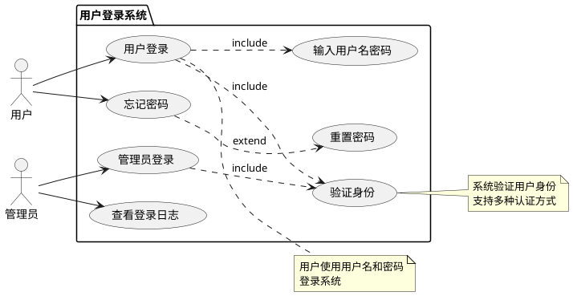

# 用户登录用例图

_2026-02-28 10:52_

---

## 📊 用例图说明

### 系统名称
**用户登录系统**

### 参与者（Actors）
1. **用户** - 普通用户，使用用户名密码登录
2. **管理员** - 系统管理员，有额外权限

---

## 🎯 用例（Use Cases）

### 主要用例

#### 1. 用户登录
- **描述**: 用户使用用户名和密码登录系统
- **参与者**: 用户
- **前置条件**: 用户已注册
- **后置条件**: 用户成功登录系统

#### 2. 管理员登录
- **描述**: 管理员使用凭据登录系统
- **参与者**: 管理员
- **前置条件**: 管理员账户存在
- **后置条件**: 管理员成功登录系统

### 支持用例

#### 3. 输入用户名密码
- **描述**: 用户输入登录凭据
- **类型**: include（包含）
- **关系**: 被用户登录包含

#### 4. 验证身份
- **描述**: 系统验证用户身份
- **类型**: include（包含）
- **关系**: 被所有登录用例包含

#### 5. 忘记密码
- **描述**: 用户忘记密码，请求重置
- **参与者**: 用户
- **类型**: base（基础）

#### 6. 重置密码
- **描述**: 系统发送密码重置链接
- **类型**: extend（扩展）
- **关系**: 扩展忘记密码

#### 7. 查看登录日志
- **描述**: 管理员查看登录历史
- **参与者**: 管理员
- **类型**: base（基础）

---

## 📝 PlantUML代码



---

## 🌐 在线查看

### 方式1: PlantUML在线编辑器
```
1. 访问: http://www.plantuml.com/plantuml/uml/
2. 复制上面的PlantUML代码
3. 粘贴到编辑器
4. 自动生成图表
```

### 方式2: 直接URL
```
http://www.plantuml.com/plantuml/uml/
（需要URL编码）
```

---

## 📊 用例关系

### Include关系（包含）
```
用户登录 --> 输入用户名密码
用户登录 --> 验证身份
管理员登录 --> 验证身份
```

### Extend关系（扩展）
```
忘记密码 --> 重置密码
```

---

## 🎯 业务流程

### 用户登录流程
```
1. 用户访问系统
2. 输入用户名和密码
3. 系统验证身份
4. 登录成功/失败
```

### 忘记密码流程
```
1. 用户点击"忘记密码"
2. 系统发送重置链接
3. 用户重置密码
4. 返回登录页面
```

### 管理员操作流程
```
1. 管理员登录
2. 系统验证身份
3. 访问管理功能
4. 查看登录日志
```

---

## 💡 设计要点

### 安全性
- ✅ 密码加密存储
- ✅ 登录失败次数限制
- ✅ 会话超时机制
- ✅ 多因素认证支持

### 用户体验
- ✅ 记住登录状态
- ✅ 友好的错误提示
- ✅ 快速密码重置
- ✅ 响应式设计

---

## 📁 文件位置

```
PlantUML代码: diagrams/user-login-usecase.puml
文档: USER-LOGIN-USECASE-DIAGRAM.md
```

---

**创建时间**: 2026-02-28 10:52
**图表类型**: 用例图（Use Case Diagram）
**状态**: ✅ 代码已生成
**查看方式**: PlantUML在线编辑器
