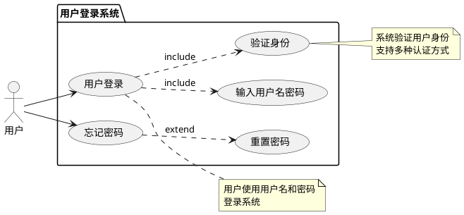

# 用户登录用例图 - 快速查看指南

_2026-02-28 10:54_

---

## 📊 PlantUML代码（可直接使用）

### 完整代码



---

## 🌐 快速查看方法

### 方法1: PlantUML在线编辑器（推荐）⭐⭐⭐

```
1. 访问: http://www.plantuml.com/plantuml/uml/
2. 复制上面的PlantUML代码
3. 粘贴到编辑器
4. 自动生成图表
```

### 方法2: VS Code插件

```
1. 安装PlantUML插件
2. 创建.puml文件
3. 粘贴代码
4. 右键预览图表
```

### 方法3: 本地工具

```
1. 安装Java和Graphviz
2. 下载PlantUML.jar
3. 命令行生成图表
```

---

## 📝 用例说明

### 参与者
- **用户** - 普通用户

### 主要用例
1. **用户登录** - 核心功能
   - 包含：输入用户名密码
   - 包含：验证身份

2. **忘记密码** - 辅助功能
   - 扩展：重置密码

---

## 🎯 关系说明

### Include关系（包含）
```
用户登录 → 输入用户名密码（必须执行）
用户登录 → 验证身份（必须执行）
```

### Extend关系（扩展）
```
忘记密码 → 重置密码（可选执行）
```

---

## 💡 下一步

**官家，您可以：**

1. **在线查看** - 访问PlantUML编辑器查看图表
2. **修改代码** - 告诉我需要添加/删除的功能
3. **创建新图表** - 描述其他需求的图表

---

**创建时间**: 2026-02-28 10:54
**图表类型**: 用例图
**状态**: ✅ 代码已生成
**查看方式**: PlantUML在线编辑器
