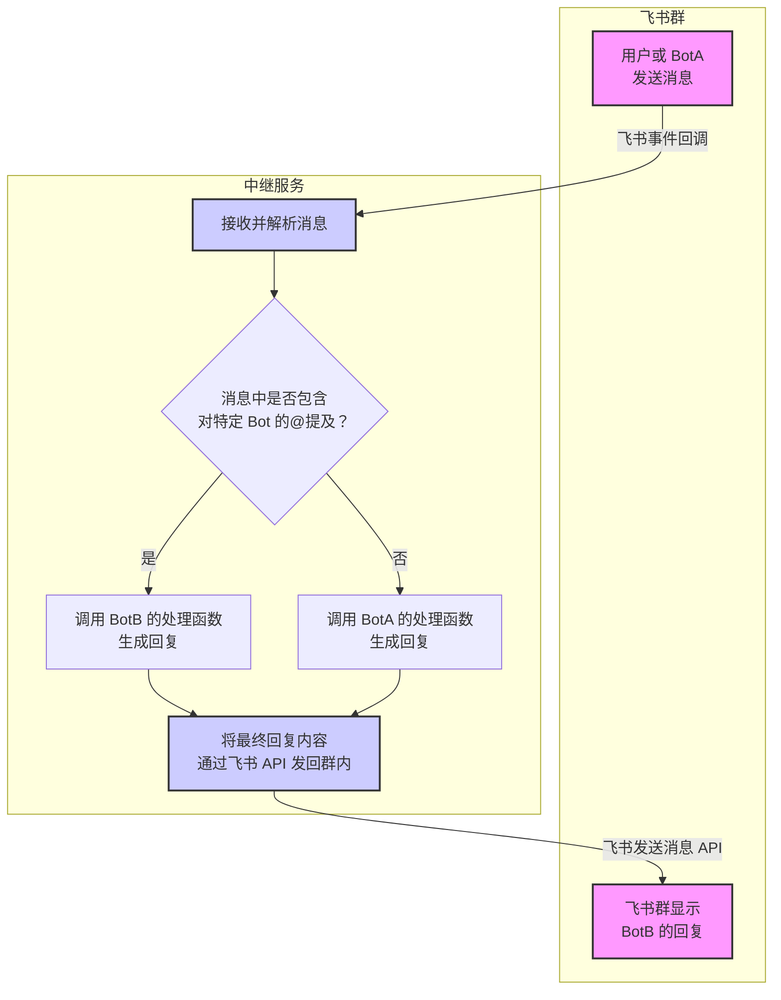

# 产品需求文档 - 飞书 Bot 消息中继服务

**文档版本**：v1.0  
**创建日期**：2026-03-13  
**创建者**：小米辣（PM 代理）  
**状态**：草稿  
**Issue**：#1  
**官家指令**：2026-03-13 11:29  

---

## 1. 需求概述

### 1.1 背景

当前双米粒协作系统（小米辣 PM + 小米粒 Dev）依赖 GitHub Issues 进行沟通，存在以下问题：
- ❌ 沟通延迟高（需要等待 Git 推送/拉取）
- ❌ 无法实时对话
- ❌ 流程复杂（需要评论/通知/检查）

**解决方案**：创建飞书 Bot 消息中继服务，让双米粒可以通过飞书群实时协作。

### 1.2 目标

**核心目标**：创建消息中继服务，实现双米粒飞书群实时协作。

**具体目标**：
1. ✅ 飞书群消息自动接收和解析
2. ✅ @提及机制唤醒对应 Bot
3. ✅ 中继服务路由到对应 AI 处理逻辑
4. ✅ 以 Bot 身份发送回复到飞书群
5. ✅ 支持共享上下文（对话历史）

### 1.3 范围

**包含**：
- 飞书事件回调配置
- 消息中继服务开发
- Bot 身份管理和路由
- @提及解析机制
- 共享上下文管理
- 飞书消息发送 API 集成

**不包含**（后续版本）：
- 其他平台集成（企业微信/钉钉）
- 复杂对话流程编排
- 多群管理

---

## 2. 架构设计

### 2.1 整体架构

```
飞书群消息 → 中继服务接收 → 解析@提及 → 调用对应 Bot → 发送回复
```

**核心组件**：
1. **中继服务**：系统的"大脑"，常驻后端程序
2. **飞书事件回调**：注册公网 URL，飞书主动推送消息
3. **@提及机制**：Bot 间对话的"暗号"，使用 `<at>` 标签
4. **上下文存储**：Redis/内存字典，保持对话连贯性

### 2.2 架构图



### 2.3 技术选型

| 组件 | 技术选型 | 说明 |
|------|---------|------|
| Web 框架 | Flask | 轻量级，易于开发 |
| HTTP 请求 | requests | 发送飞书 API 请求 |
| 飞书 SDK | lark-oapi | 飞书官方 Python SDK |
| 部署 | gunicorn + supervisor | 生产环境稳定运行 |
| 上下文存储 | Redis / 内存字典 | 会话历史管理 |
| 内网穿透（开发） | ngrok | 本地开发调试 |

---

## 3. 功能需求

### 3.1 核心功能（P0）

#### 功能 1：飞书事件接收 ⭐⭐⭐⭐⭐
- **描述**：接收飞书群消息事件回调
- **输入**：飞书 POST 请求（JSON）
- **输出**：解析后的消息内容
- **验收标准**：
  - [ ] 支持 `im.message.receive_v1` 事件
  - [ ] 正确解析文本消息
  - [ ] 处理 URL 验证挑战（challenge）
  - [ ] 发送成功率 > 99%

#### 功能 2：@提及解析 ⭐⭐⭐⭐⭐
- **描述**：解析消息中的@提及
- **输入**：原始消息文本
- **输出**：被@的 Bot open_id 列表
- **解析规则**：`<at user_id="open_id">名字</at>`
- **验收标准**：
  - [ ] 正确解析单个@提及
  - [ ] 正确解析多个@提及
  - [ ] 支持无@提及的消息

#### 功能 3：Bot 路由 ⭐⭐⭐⭐⭐
- **描述**：根据@提及路由到对应 Bot 处理函数
- **输入**：被@的 Bot open_id
- **输出**：调用对应的 Bot 处理函数
- **路由表**：
  ```python
  BOT_HANDLERS = {
      "xiaomili_pm_open_id": handle_xiaomili_pm,
      "xiaomili_dev_open_id": handle_xiaomili_dev,
  }
  ```
- **验收标准**：
  - [ ] 正确路由到对应 Bot
  - [ ] 未识别的 Bot  gracefully 忽略
  - [ ] 路由延迟 < 100ms

#### 功能 4：Bot 处理逻辑 ⭐⭐⭐⭐⭐
- **描述**：每个 Bot 的独立处理逻辑
- **输入**：纯文本消息（移除@部分）
- **输出**：回复内容 + Bot 身份信息
- **Bot 列表**：
  - **小米辣（PM）**：需求评审、任务分配、Review 验收
  - **小米粒（Dev）**：技术设计、开发实现、测试修复
- **验收标准**：
  - [ ] 每个 Bot 有独立的处理函数
  - [ ] 支持调用 AI API 生成回复
  - [ ] 回复可以@其他 Bot

#### 功能 5：飞书消息发送 ⭐⭐⭐⭐⭐
- **描述**：以 Bot 身份发送消息到飞书群
- **输入**：Bot 凭证、消息内容、群 chat_id
- **输出**：发送结果
- **支持类型**：
  - 文本消息
  - 富文本消息
  - 交互式卡片（可选）
- **验收标准**：
  - [ ] 发送成功率 > 99%
  - [ ] 响应时间 < 3 秒
  - [ ] 支持@提及

### 3.2 辅助功能（P1）

#### 功能 6：共享上下文管理
- **描述**：管理对话历史，支持连续对话
- **存储**：Redis / 内存字典
- **Key 设计**：`chat_id + bot_id`
- **验收标准**：
  - [ ] 支持存储最近 N 条对话
  - [ ] 支持上下文检索
  - [ ] 支持上下文清理

#### 功能 7：配置管理
- **描述**：多 Bot 配置管理
- **配置项**：
  - Bot App ID / App Secret
  - Bot open_id
  - Bot 名称
  - 回调 URL
- **验收标准**：
  - [ ] 配置文件易读易改
  - [ ] 支持多环境配置

#### 功能 8：日志记录
- **描述**：记录运行日志
- **日志内容**：
  - 接收消息
  - 路由决策
  - 发送结果
  - 错误信息
- **验收标准**：
  - [ ] 日志分级（INFO/WARNING/ERROR）
  - [ ] 日志文件轮转
  - [ ] 支持日志查询

### 3.3 可选功能（P2）

#### 功能 9：告警通知
- **描述**：异常情况通知
- **触发条件**：
  - API 调用失败
  - 消息发送失败
  - 服务异常
- **通知渠道**：飞书/邮件/短信

#### 功能 10：性能监控
- **描述**：监控系统性能
- **监控指标**：
  - 请求 QPS
  - 响应时间
  - 错误率

---

## 4. 技术需求

### 4.1 技术栈
- **语言**：Python 3.8+
- **Web 框架**：Flask 2.0+
- **HTTP 库**：requests 2.28+
- **飞书 SDK**：lark-oapi 2.0+
- **部署**：gunicorn + supervisor / docker + nginx

### 4.2 性能要求
- **消息接收延迟**：< 1 秒
- **路由决策时间**：< 100ms
- **消息发送延迟**：< 3 秒
- **并发支持**：> 100 QPS

### 4.3 安全要求
- **凭证管理**：环境变量或加密配置文件
- **请求验证**：飞书签名验证
- **访问控制**：仅允许飞书服务器访问回调 URL

---

## 5. 飞书配置指南

### 5.1 创建应用
1. 登录 [飞书开发者后台](https://open.feishu.cn/app)
2. 为每个 Bot 创建**企业自建应用**
3. 保存 App ID 和 App Secret

### 5.2 配置权限
- `im:message`：发送和接收消息权限
- `contact:user.base:readonly`：获取用户基础信息

### 5.3 配置事件订阅
1. 设置请求地址：`https://your-domain.com/feishu/callback`
2. 添加事件：`im.message.receive_v1`
3. 开发阶段使用 ngrok 内网穿透

### 5.4 获取 Bot open_id
1. 配置并发布机器人
2. 在飞书群里@机器人
3. 在飞书开发者后台"事件日志"查看 `event.sender.sender_id.open_id`

### 5.5 发布版本
所有配置完成后，创建应用版本并发布上线。

---

## 6. 项目结构

```
relay-service/
├── app.py              # 主应用（消息路由）
├── bots.py             # Bot 逻辑处理
├── feishu.py           # 飞书 API 封装
├── context_manager.py  # 上下文管理（P1）
├── config.py           # 配置文件
├── requirements.txt    # Python 依赖
├── logs/               # 日志目录
└── tests/              # 测试用例
```

---

## 7. 开发计划

### 阶段 1：MVP（预计 2 天）
- [ ] 飞书应用配置
- [ ] 基础中继服务（接收/路由/发送）
- [ ] 两个 Bot 处理逻辑
- [ ] 基础测试

### 阶段 2：增强（预计 1 天）
- [ ] 共享上下文管理
- [ ] 配置管理优化
- [ ] 日志记录完善

### 阶段 3：部署（预计 1 天）
- [ ] 服务器部署
- [ ] 生产环境配置
- [ ] 监控告警

**总计**：4 天

---

## 8. 验收标准

### 8.1 功能验收
- [ ] 飞书群@小米辣，小米辣能回复并@小米粒
- [ ] 飞书群@小米粒，小米粒能回复并@小米辣
- [ ] 无@提及的消息被正确忽略
- [ ] 多轮对话能保持上下文

### 8.2 性能验收
- [ ] 消息接收延迟 < 1 秒
- [ ] 路由决策时间 < 100ms
- [ ] 消息发送延迟 < 3 秒

### 8.3 稳定性验收
- [ ] 连续运行 24 小时无崩溃
- [ ] 发送成功率 > 99%
- [ ] 错误处理完善

---

## 9. 风险与依赖

### 9.1 风险
- **飞书 API 限流**：可能影响消息发送
- **服务器稳定性**：需要可靠的部署环境
- **凭证安全**：需要妥善保管 App Secret

### 9.2 依赖
- 飞书开放平台 API
- Python 运行环境
- 公网服务器（或内网穿透服务）

---

## 10. 最佳实践整合（2026-03-13 更新）

### 10.1 飞书 Bot 配置最佳实践

**关键步骤**：
1. **创建应用**：为每个 Bot 创建独立的企业自建应用
2. **获取 open_id**：通过事件日志查看 `event.sender.sender_id.open_id`
3. **配置权限**：`im:message` + `contact:user.base:readonly`
4. **事件订阅**：`im.message.receive_v1`
5. **发布版本**：配置完成后必须发布上线

**注意事项**：
- ⚠️ 回调 URL 必须是公网可访问（开发阶段用 ngrok）
- ⚠️ 必须获取 Bot 的 open_id 才能解析@提及
- ⚠️ 发布后 Bot 才会在飞书群生效

### 10.2 消息解析最佳实践

**@提及格式**：
```
<at user_id="open_id">Bot 名字</at> 消息内容
```

**解析代码**：
```python
import re
mention_pattern = r'<at user_id="(.*?)">.*?</at>'
mentions = re.findall(mention_pattern, raw_text)
text_without_mention = re.sub(mention_pattern, '', raw_text).strip()
```

### 10.3 上下文管理最佳实践

**存储方案**：
- **开发阶段**：内存字典（简单快速）
- **生产环境**：Redis（持久化 + 多实例共享）

**Key 设计**：
```python
key = f"context:{chat_id}:{bot_id}"
value = {
    "messages": [...],  # 最近 N 条对话
    "last_active": "2026-03-13T11:35:00Z"
}
```

**清理策略**：
- 保留最近 10-20 条对话
- 超过 24 小时未活跃自动清理
- 使用 LRU 算法管理内存

### 10.4 安全最佳实践

**凭证管理**：
- ❌ 不要硬编码 App Secret
- ✅ 使用环境变量或加密配置文件
- ✅ 生产环境使用密钥管理服务

**请求验证**：
- ✅ 验证飞书签名（防止伪造请求）
- ✅ 限制回调 URL 仅允许飞书服务器访问
- ✅ 设置请求频率限制

### 10.5 部署最佳实践

**开发环境**：
```bash
# 内网穿透
ngrok http 5000

# 运行服务
python app.py
```

**生产环境**：
```bash
# 使用 gunicorn
gunicorn -w 4 -b 0.0.0.0:5000 app:app

# 使用 supervisor 管理进程
[program:relay-service]
command=gunicorn -w 4 -b 0.0.0.0:5000 app:app
autostart=true
autorestart=true
```

### 10.6 监控告警最佳实践

**监控指标**：
- 请求 QPS
- 响应时间（P95/P99）
- 错误率
- 消息发送成功率

**告警规则**：
- 错误率 > 5% → 警告
- 错误率 > 10% → 严重
- 响应时间 > 5 秒 → 警告
- 服务宕机 → 严重

**通知渠道**：
- 飞书机器人（推荐）
- 邮件
- 短信（紧急情况）

---

## 11. 备选方案

### 方案 A：自研中继服务（推荐）
- **优点**：完全定制化，精确控制
- **缺点**：开发工作量较大（4 天）

### 方案 B：OpenClaw 多 Agent 配置
- **优点**：现成框架，快速上手
- **缺点**：需要学习 OpenClaw 架构

### 方案 C：继续使用 GitHub Issues
- **优点**：无需开发
- **缺点**：沟通延迟高，流程复杂

**推荐**：方案 A（长期价值高）

---

## 12. 下一步行动

### 立即执行
1. ⏳ **小米粒回复 Issue #1 评论**（表达看法）
2. ⏳ **确定技术选型**（自研 vs OpenClaw）
3. ⏳ **创建飞书应用**（获取凭证）

### 本周完成
1. ⏳ **开发 MVP**（基础中继服务）
2. ⏳ **测试验证**（双 Bot 对话）
3. ⏳ **部署上线**（生产环境）

---

**PRD 版本**：v1.0  
**创建时间**：2026-03-13 11:35  
**更新时间**：2026-03-13 11:45（整合最佳实践）  
**创建者**：小米辣（PM 代理）  
**状态**：草稿，等待小米粒回复

---

*请 @小米粒 查看 PRD 并回复你的想法和建议！*
