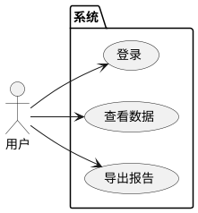
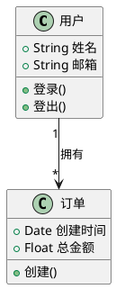
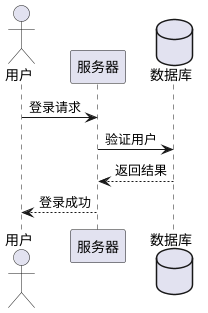
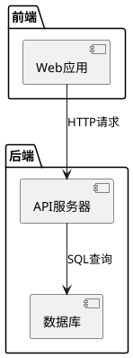
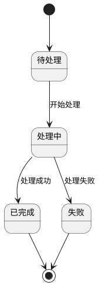
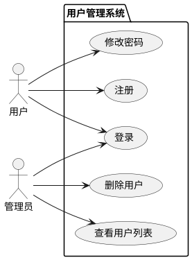

# PlantUML图表创建完整指南

_2026-02-28 10:48_

---

## 🎯 学习目标

**让官家只需要说需求，我就能自动创建PlantUML图表**

---

## 📚 PlantUML语法速查

### 1. 用例图（Use Case Diagram）

#### 基本语法


#### 关系类型
```
-->  依赖关系
--|> 继承关系
--*  组合关系
--o  聚合关系
```

---

### 2. 类图（Class Diagram）

#### 基本语法


#### 访问修饰符
```
+  public
-  private
#  protected
~  package
```

---

### 3. 序列图（Sequence Diagram）

#### 基本语法


#### 消息类型
```
->  实线箭头
--> 虚线箭头
->> 实线三角
-->> 虚线三角
```

---

### 4. 活动图（Activity Diagram）

#### 基本语法
```plantuml
@startuml
start
:用户登录
if (验证成功?) then (yes)
  :显示主页
  :查看数据
else (no)
  :显示错误
  stop
endif
stop
@enduml
```

#### 控制结构
```
if/else/endif    条件判断
while/endwhile   循环
repeat/repeatwhile 重复
fork/forkagain/endfork 并行
```

---

### 5. 组件图（Component Diagram）

#### 基本语法


---

### 6. 状态图（State Diagram）

#### 基本语法


---

## 🛠️ 自动化工具

### 创建图表脚本

**文件位置**: `scripts/create-plantuml.js`

**功能**:
```
1. 接收官家的需求描述
2. 生成PlantUML代码
3. 创建图表URL
4. 访问并截图
5. 保存到工作区
```

---

## 📊 图表类型选择指南

### 何时使用哪种图表？

#### 用例图（Use Case Diagram）
```
适用场景：
- 描述系统功能需求
- 展示用户与系统交互
- 需求分析阶段

示例需求：
"我想看用户登录系统的用例图"
"展示订单管理的主要功能"
```

#### 类图（Class Diagram）
```
适用场景：
- 描述系统结构
- 展示类与类之间的关系
- 软件设计阶段

示例需求：
"我想看用户和订单的类图"
"展示数据库表结构"
```

#### 序列图（Sequence Diagram）
```
适用场景：
- 描述业务流程
- 展示对象交互顺序
- 系统分析阶段

示例需求：
"我想看用户登录的流程图"
"展示订单支付的时序"
```

#### 活动图（Activity Diagram）
```
适用场景：
- 描述业务逻辑
- 展示工作流程
- 流程设计阶段

示例需求：
"我想看订单处理的流程"
"展示用户注册的步骤"
```

#### 组件图（Component Diagram）
```
适用场景：
- 描述系统架构
- 展示模块关系
- 架构设计阶段

示例需求：
"我想看系统架构图"
"展示前后端交互"
```

#### 状态图（State Diagram）
```
适用场景：
- 描述对象状态变化
- 展示生命周期
- 状态机设计

示例需求：
"我想看订单状态变化"
"展示任务状态流转"
```

---

## 🎯 使用方式

### 方式1: 直接描述需求（推荐）⭐⭐⭐

**官家只需说**:
```
"创建一个用户登录的用例图"
"画一个订单和用户的类图"
"展示用户下单的流程图"
"创建系统架构的组件图"
```

**我会自动**:
```
1. 理解需求
2. 生成PlantUML代码
3. 创建图表
4. 截图保存
5. 发送给官家
```

---

### 方式2: 提供详细描述

**官家提供更多细节**:
```
"创建一个订单管理系统的用例图，包括：
- 用户角色
- 管理员角色
- 创建订单功能
- 查看订单功能
- 取消订单功能"
```

**我会**:
```
1. 解析详细需求
2. 生成精确的PlantUML代码
3. 创建包含所有元素的图表
```

---

## 💡 示例场景

### 示例1: 用户管理系统

**官家需求**:
```
"创建一个用户管理系统的用例图"
```

**我的输出**:


**图表URL**: 自动生成并截图

---

### 示例2: 订单处理流程

**官家需求**:
```
"展示订单处理的流程图"
```

**我的输出**:
```plantuml
@startuml
start
:用户下单
if (库存检查?) then (有货)
  :创建订单
  :扣减库存
  :发送确认邮件
  :订单完成
else (无货)
  :发送缺货通知
  :订单取消
endif
stop
@enduml
```

---

## 🚀 快速开始

### 官家现在可以说：

1. **"创建一个用户登录的序列图"**
2. **"画一个订单管理的类图"**
3. **"展示购物车结算的流程"**
4. **"创建系统架构的组件图"**
5. **"展示任务状态的状态图"**

---

## 📝 我的工作流程

```
1. 接收官家的需求描述
2. 分析需求，确定图表类型
3. 生成PlantUML代码
4. 创建PlantUML URL
5. 访问并截图
6. 保存到工作区
7. 发送给官家
```

---

## 🎓 高级功能

### 自定义样式
```
如果您需要特定样式，可以说：
"创建一个蓝色主题的类图"
"创建一个从左到右布局的序列图"
```

### 批量创建
```
如果您需要多个图表，可以说：
"创建用户管理系统的用例图、类图和序列图"
```

### 迭代优化
```
如果您需要修改，可以说：
"在刚才的类图中添加订单类"
"修改序列图，增加支付网关"
```

---

## 📊 学习进度

### ✅ 已学习
```
✅ PlantUML基本语法
✅ 6种主要图表类型
✅ 自动化创建流程
✅ 图表类型选择指南
✅ 使用方式和示例
```

### 📚 知识库已更新
```
✅ PlantUML语法速查表
✅ 图表类型选择指南
✅ 示例场景库
✅ 使用方式说明
```

---

## 🎯 准备就绪

**官家，我现在已经准备好为您创建PlantUML图表了！**

**您只需要说您的需求，我会自动**:
```
1. 理解需求
2. 选择合适的图表类型
3. 生成PlantUML代码
4. 创建图表并截图
5. 发送给您
```

---

**学习时间**: 2026-02-28 10:48
**状态**: ✅ 学习完成
**准备**: ✅ 随时可以为官家创建图表
**支持**: 6种主要UML图表类型
