# PlantUML 图表创建完整指南

_2026-03-02 学习并实践_

---

## 🎯 PlantUML简介

**PlantUML** 是一个开源工具，用简单的文本描述来创建UML图表和其他类型的图表。

**核心优势：**
- ✅ 简单文本语法
- ✅ 版本控制友好
- ✅ 多种图表类型
- ✅ 自动布局
- ✅ 多种输出格式（PNG、SVG、ASCII）

---

## 📚 支持的图表类型

### 1. 用例图（Use Case Diagram）
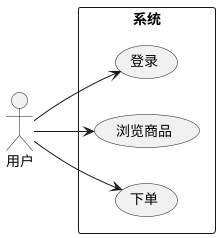

### 2. 类图（Class Diagram）
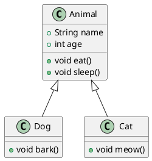

### 3. 序列图（Sequence Diagram）
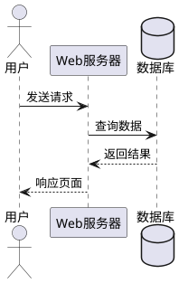

### 4. 活动图（Activity Diagram）
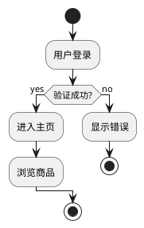

### 5. 组件图（Component Diagram）
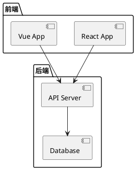

### 6. 状态图（State Diagram）
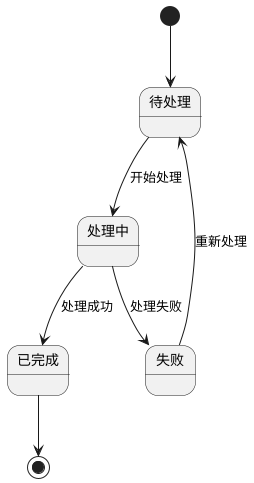

### 7. 对象图（Object Diagram）
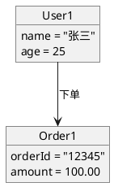

### 8. 部署图（Deployment Diagram）
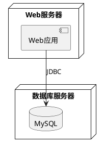

### 9. 时序图（Timing Diagram）
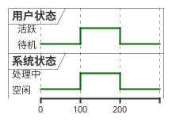

### 10. 网络图（Network Diagram）
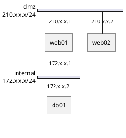

### 11. JSON数据
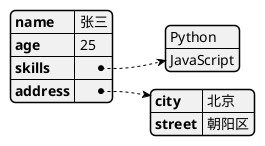

### 12. YAML数据


### 13. 思维导图（MindMap）
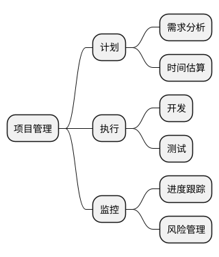

### 14. 甘特图（Gantt Chart）
```plantuml
@startgantt
[需求分析] lasts 5 days
[设计] lasts 3 days
[开发] lasts 10 days
[测试] lasts 5 days
[部署] lasts 2 days

[设计] starts at [需求分析]'s end
[开发] starts at [设计]'s end
[测试] starts at [开发]'s end
[部署] starts at [test]'s end
@endgantt
```

---

## 🛠️ 如何创建PlantUML图表

### 方法1：在线编辑器

**PlantUML官方编辑器：**
- 网址：http://www.plantuml.com/plantuml/uml/
- 优点：无需安装，即用即走
- 缺点：需要网络连接

**使用步骤：**
1. 访问：http://www.plantuml.com/plantuml/uml/
2. 输入PlantUML代码
3. 自动生成图表
4. 可选择输出格式：PNG、SVG、ASCII

### 方法2：PlantUML Web Editor（推荐）
- 网址：https://editor.plantuml.com/
- 优点：功能更强大，支持实时预览
- 缺点：需要网络连接

### 方法3：本地安装（离线使用）

**安装步骤：**
```bash
# macOS
brew install plantuml

# Ubuntu/Debian
sudo apt-get install plantuml

# Windows (需要Java)
# 下载 plantuml.jar
java -jar plantuml.jar diagram.puml
```

**生成图片：**
```bash
# 生成PNG
plantuml diagram.puml

# 生成SVG
plantuml -tsvg diagram.puml

# 生成ASCII
plantuml -ttxt diagram.puml
```

### 方法4：VS Code插件

**安装步骤：**
1. 安装VS Code扩展：PlantUML
2. 安装Java运行环境
3. 创建 `.puml` 文件
4. 按 `Alt+D` 预览

### 方法5：IntelliJ IDEA插件

**安装步骤：**
1. Settings → Plugins → 搜索 "PlantUML integration"
2. 安装插件
3. 创建 `.puml` 文件
4. 右键 → Preview PlantUML

---

## 📐 PlantUML基础语法

### 注释
```plantuml
' 这是单行注释

/'
这是
多行注释
'/
```

### 分隔符
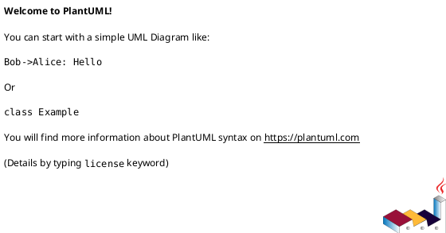

### 定义元素
```plantuml
' 定义类
class MyClass

' 定义接口
interface MyInterface

' 定义参与者
participant User

' 定义actor
actor Admin
```

### 关系
```plantuml
' 继承
ClassA <|-- ClassB

' 实现
Interface <|.. ClassC

' 依赖
ClassD ..> ClassE

' 关联
ClassF --> ClassG

' 聚合
ClassH o-- ClassI

' 组合
ClassJ *-- ClassK
```

### 箭头样式
```plantuml
' 实线
-->

' 虚线
..>

' 粗线
==>

' 隐藏箭头
-->

' 自定义颜色
-[#red]->
```

### 标签
```plantuml
ClassA --> ClassB : 关联
ClassC ..> ClassD : 依赖
```

### 包（Package）
```plantuml
package "用户模块" {
  class User
  class Role
}

package "订单模块" {
  class Order
  class Product
}
```

### 命名空间（Namespace）
```plantuml
namespace com.example {
  class MyClass
}

com.example.MyClass --> OtherClass
```

---

## 🎨 样式定制

### 颜色
```plantuml
' 元素颜色
class MyClass #LightBlue

' 关系颜色
ClassA -[#red]-> ClassB

' 背景颜色
skinparam backgroundColor #EEEBDC
```

### 字体
```plantuml
skinparam class {
  FontName Arial
  FontSize 12
  FontStyle Bold
}
```

### 布局方向
```plantuml
' 从左到右
left to right direction

' 从上到下（默认）
top to bottom direction
```

### 主题
```plantuml
' 使用主题
!theme cerulean

' 可用主题：
' cerulean, sketchy, toy, vibrant, etc.
```

---

## 💡 实战案例

### 案例1：电商系统架构图
```plantuml
@startuml
!define RECTANGLE class

package "用户端" {
  [Web前端]
  [移动App]
}

package "服务端" {
  [API网关]
  [用户服务]
  [商品服务]
  [订单服务]
  [支付服务]
}

package "数据层" {
  database "MySQL"
  database "Redis"
}

[Web前端] --> [API网关] : HTTPS
[移动App] --> [API网关] : HTTPS

[API网关] --> [用户服务]
[API网关] --> [商品服务]
[API网关] --> [订单服务]
[API网关] --> [支付服务]

[用户服务] --> MySQL
[商品服务] --> MySQL
[订单服务] --> MySQL
[支付服务] --> MySQL

[API网关] --> Redis : 缓存
@enduml
```

### 案例2：用户登录流程
```plantuml
@startuml
actor 用户
participant "前端页面" as Front
participant "API服务" as API
database "数据库" as DB

用户 -> Front: 输入账号密码
Front -> API: POST /api/login
API -> DB: 查询用户信息
DB --> API: 返回用户数据

alt 验证成功
  API --> Front: 返回Token
  Front --> 用户: 登录成功，跳转首页
else 验证失败
  API --> Front: 返回错误信息
  Front --> 用户: 显示错误提示
end
@enduml
```

### 案例3：微服务架构
```plantuml
@startuml
!define COMPONENT class

package "前端" {
  [React App]
}

package "API网关" {
  [Kong Gateway]
}

package "微服务集群" {
  component [用户服务]
  component [商品服务]
  component [订单服务]
  component [支付服务]
}

package "消息队列" {
  [RabbitMQ]
}

package "数据存储" {
  database "PostgreSQL"
  database "MongoDB"
  database "Redis"
}

[React App] --> [Kong Gateway]
[Kong Gateway] --> [用户服务]
[Kong Gateway] --> [商品服务]
[Kong Gateway] --> [订单服务]
[Kong Gateway] --> [支付服务]

[订单服务] --> [RabbitMQ] : 发送消息
[支付服务] --> [RabbitMQ] : 接收消息

[用户服务] --> PostgreSQL
[商品服务] --> MongoDB
[订单服务] --> PostgreSQL
[支付服务] --> Redis
@enduml
```

---

## 🔗 生成图片的方法

### 方法1：在线生成URL

**格式：**
```
http://www.plantuml.com/plantuml/png/{encoded}
http://www.plantuml.com/plantuml/svg/{encoded}
http://www.plantuml.com/plantuml/txt/{encoded}
```

**编码方式：**
1. 将PlantUML代码转换为UTF-8
2. 使用Deflate压缩
3. 使用自定义Base64编码

**示例：**
```
http://www.plantuml.com/plantuml/png/SoWkIImgAStDuNBAJrBGjLDmpCbCJbMmKiX8pSd9vt98pKi1IW40
```

### 方法2：使用API

**POST请求：**
```bash
curl -X POST \
  http://www.plantuml.com/plantuml/png \
  -d "text=@startuml\nAlice -> Bob\n@enduml"
```

### 方法3：命令行工具

```bash
# 生成PNG
plantuml -tpng diagram.puml

# 生成SVG
plantuml -tsvg diagram.puml

# 批量生成
plantuml -tpng *.puml
```

### 方法4：Python库

```python
import plantuml

# 创建PlantUML客户端
pl = plantuml.PlantUML(url='http://www.plantuml.com/plantuml/png/')

# 定义PlantUML代码
code = """
@startuml
Alice -> Bob
@enduml
"""

# 生成图片
pl.processes(code)
```

### 方法5：JavaScript库

```javascript
// 使用plantuml-encoder
const plantumlEncoder = require('plantuml-encoder')

const code = `
@startuml
Alice -> Bob
@enduml
`

const encoded = plantumlEncoder.encode(code)
const url = `http://www.plantuml.com/plantuml/png/${encoded}`

console.log(url)
```

---

## 🌐 官方资源

### 官方文档
- PlantUML官网：https://plantuml.com/
- 快速指南：https://plantuml.com/quick-start
- 参考指南：https://plantuml.com/reference

### 在线工具
- 官方编辑器：http://www.plantuml.com/plantuml/uml/
- 高级编辑器：https://editor.plantuml.com/
- 实时预览：https://plantuml.com/zh/online

### 学习资源
- GitHub：https://github.com/plantuml/plantuml
- 示例库：https://plantuml.com/zh/examples
- 问答社区：https://forum.plantuml.net/

---

## 🎯 使用建议

### 最佳实践
1. **版本控制**：将 `.puml` 文件纳入Git管理
2. **模块化**：使用 `!include` 引入公共部分
3. **命名规范**：使用有意义的名称
4. **注释清晰**：添加必要的注释说明
5. **定期重构**：保持图表简洁清晰

### 注意事项
1. **复杂度控制**：单个图表不要太复杂
2. **性能考虑**：大图生成较慢
3. **网络依赖**：在线工具需要网络
4. **编码问题**：注意UTF-8编码
5. **安全考虑**：不要在图表中包含敏感信息

---

## 📝 快速参考卡

### 常用图表类型
| 图表类型 | 开始标记 | 用途 |
|---------|---------|------|
| 序列图 | @startuml | 交互流程 |
| 类图 | @startuml | 类结构 |
| 用例图 | @startuml | 功能需求 |
| 活动图 | @startuml | 业务流程 |
| 组件图 | @startuml | 系统架构 |
| 状态图 | @startuml | 状态变化 |
| 思维导图 | @startmindmap | 知识结构 |
| 甘特图 | @startgantt | 项目计划 |

### 常用关系
| 符号 | 含义 | 示例 |
|-----|------|------|
| --> | 关联 | A --> B |
| --| | 继承 | A <|-- B |
| ..>| | 依赖 | A ..> B |
| o-- | 聚合 | A o-- B |
| *-- | 组合 | A *-- B |

---

*创建时间：2026-03-02 22:58*
*学习深度：完整指南*
*实战价值：⭐⭐⭐⭐⭐*
